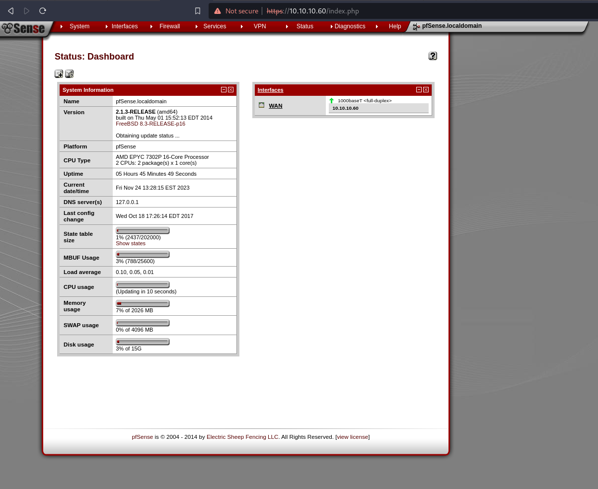

https://app.hackthebox.com/machines/111

# Network recon

```sh
$ sudo nmap --script=default -sV -oA nmap/initial $RHOST
Starting Nmap 7.94 ( https://nmap.org ) at 2023-11-23 06:27 EST
Nmap scan report for 10.10.10.60
Host is up (0.13s latency).
Not shown: 998 filtered tcp ports (no-response)
PORT    STATE SERVICE  VERSION
80/tcp  open  http     lighttpd 1.4.35
|_http-server-header: lighttpd/1.4.35
|_http-title: Did not follow redirect to https://10.10.10.60/
443/tcp open  ssl/http lighttpd 1.4.35
|_http-title: Login
|_http-server-header: lighttpd/1.4.35
|_ssl-date: TLS randomness does not represent time
| ssl-cert: Subject: commonName=Common Name (eg, YOUR name)/organizationName=CompanyName/stateOrProvinceName=Somewhere/countryName=US
| Not valid before: 2017-10-14T19:21:35
|_Not valid after:  2023-04-06T19:21:35

Service detection performed. Please report any incorrect results at https://nmap.org/submit/ .
Nmap done: 1 IP address (1 host up) scanned in 37.15 seconds

```

# Webapp - pfSense

["pfSense"](https://www.pfsense.org/) is an opensource Firewall system running on OpenBSD.

**Version enumeration**

An initial search of the source code does not reveal anything useful.

Perhaps the `PFSense` version could be inferred by the `jQuery` version?

I had the idea of making an image lookup for:


I investigated the following search results:
```
https://www.slideshare.net/monaco732/oss2014-pfsense
https://archive.org/details/manualzilla-id-6321023
https://www.slideserve.com/talon/pfsense
```
The results suggests that the RHOST is running `pfSense v. 2.1`.


<table>
  <tr>
    <th></th>
    <th>Name</th>
    <th>Version</th>
  </tr>
  
  <tr>
    <th>Language</th>
    <td>PHP</td>
    <td>?</td>
  </tr>
  
  <tr>
    <th>Webserver</th>
    <td>Lighttpd</td>
    <td>1.4.35</td>
  </tr>

  <tr>
    <th>Vendor</th>
    <td>PF Sense</td>
    <td>2.1.x (assumed)</td>
  </tr>
</table>


## Exploit search
There are no known vulnerabilites for `lighttpd v. 1.4.35`.

A quick `$ searchsploit pfsense` reveals plenty of vulnerabilities for v. 2.1.x <` but most of them either rely on XSS vulnerabilites (which are most irrelevant in an environment like HTB where there are no active clients) or require prior authentication.


## Directory enumeration
Running go-buster


```sh
$ gobuster dir -u https://$RHOST -w /usr/share/seclists/Discovery/Web-Content/directory-list-2.3-medium.txt -t 10 -x php,txt,bak
```

* `-u`: **Host selection**
* `-w ...` **Wordlist**
* `-t 10` **Execture with 10 threads**
* `-x php,txt,bak` **Look for .php and .txt files**
* 


```sh
/index.php            (Status: 200) [Size: 6690]
/help.php             (Status: 200) [Size: 6689]
/themes               (Status: 301) [Size: 0] [--> https://10.10.10.60/themes/]
/stats.php            (Status: 200) [Size: 6690]
/css                  (Status: 301) [Size: 0] [--> https://10.10.10.60/css/]
/edit.php             (Status: 200) [Size: 6689]
/includes             (Status: 301) [Size: 0] [--> https://10.10.10.60/includes/]
/license.php          (Status: 200) [Size: 6692]
/system.php           (Status: 200) [Size: 6691]
/status.php           (Status: 200) [Size: 6691]
/javascript           (Status: 301) [Size: 0] [--> https://10.10.10.60/javascript/]
/classes              (Status: 301) [Size: 0] [--> https://10.10.10.60/classes/]
/exec.php             (Status: 200) [Size: 6689]
/widgets              (Status: 301) [Size: 0] [--> https://10.10.10.60/widgets/]
/graph.php            (Status: 200) [Size: 6690]
/tree                 (Status: 301) [Size: 0] [--> https://10.10.10.60/tree/]
/wizard.php           (Status: 200) [Size: 6691]
/shortcuts            (Status: 301) [Size: 0] [--> https://10.10.10.60/shortcuts/]
/pkg.php              (Status: 200) [Size: 6688]
/installer            (Status: 301) [Size: 0] [--> https://10.10.10.60/installer/]
/wizards              (Status: 301) [Size: 0] [--> https://10.10.10.60/wizards/]
/xmlrpc.php           (Status: 200) [Size: 384]
/reboot.php           (Status: 200) [Size: 6691]
/interfaces.php       (Status: 200) [Size: 6695]
/csrf                 (Status: 301) [Size: 0] [--> https://10.10.10.60/csrf/]
/filebrowser          (Status: 301) [Size: 0] [--> https://10.10.10.60/filebrowser/]
/%7Echeckout%7E       (Status: 403) [Size: 345]
Progress: 441120 / 441122 (100.00%)
===============================================================
Finished
===============================================================

```


Interesting result: `https://10.10.10.60/system-users.txt`


Reveals a support ticket with the following contents:
```
####Support ticket###

Please create the following user


username: rohit
password: company defaults
```

A quick google reveals that the default password for `pfSense` is `pfsense`.

Attempting authentication with:
```
username: rohit
password: pfsense
```

**Yatzi...**



Now it's basically a pick and mix of whichever vulnerabilites.


## Credential bruteforcing

Attempting to input `admin:admin` credentials. 
No luck.
The system bans you after 15 failed login attempts.

https://packetstormsecurity.com/files/171791/pfsenseCE-2.6.0-Protection-Bypass.html